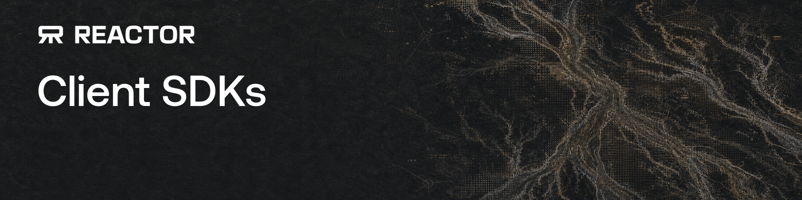

**Client SDKs for real-time Reactor sessions, across every platform.**

[🌐 Reactor](https://reactor.inc) · [⚙️ Runtime](https://github.com/reactor-team/reactor-runtime) · [🎥 WebRTC](https://github.com/reactor-team/reactor-webrtc) · [📖 Cookbook](https://github.com/reactor-team/reactor-cookbook)

---

Reactor client SDKs connect an application to a live Reactor model over
WebRTC: session lifecycle, audio/video tracks, application commands, and
recording — behind one small API per language. Native platforms
(Python today; iOS, Android, Go planned) share one Rust implementation of
the protocol logic, so behavior stays identical across those; the
browser-native JavaScript SDK speaks the same wire protocol but is its own
implementation, since a browser drives WebRTC through its own APIs rather
than through this repo's native code.

## Getting started

**🐍 Python** — the only SDK shipping today. Quick start, install steps
(the native library currently needs to be built from source — see why in the
package README), and full API reference:
[`sdks/python/README.md`](sdks/python/README.md).

**JavaScript** — `@reactor-team/js-sdk` already exists and talks the same
wire protocol (see
[`crates/reactor-protocol/src/lib.rs`](crates/reactor-protocol/src/lib.rs)).
It's planned to move into this repo alongside the other SDKs; until then
it's maintained separately.

**More native platforms** — `reactor-ffi` already targets iOS and Android
(`crates/reactor-ffi/Cargo.toml`), and `reactor-core`'s own docs list
Swift, Kotlin and Go as bindings built on the same C ABI. None of those
SDKs exist in this repo yet; when one lands (native or JavaScript) it gets
its own `sdks/<platform>/README.md` alongside this one.

## Documentation

- [`docs/concepts.md`](docs/concepts.md) — sessions and connection state,
  tracks and capabilities, application vs. runtime scope, callback
  threading. Start here.
- [`docs/messaging.md`](docs/messaging.md) — sending commands, receiving
  messages, capabilities negotiation, and track publish/pause/resume.
- [`docs/recording.md`](docs/recording.md) — clips and full-session
  recordings.
- [`docs/frame-metadata.md`](docs/frame-metadata.md) — tagging and reading
  per-frame metadata trailers on video tracks.
- [`docs/README.md`](docs/README.md) is the index if you're looking for
  something specific.

## Contributing

See [`CONTRIBUTING.md`](CONTRIBUTING.md) for dev setup, code style, commit
conventions, and how to open a pull request.

## Licensing

This repository is **Apache-2.0** licensed — see [`LICENSE`](LICENSE).
