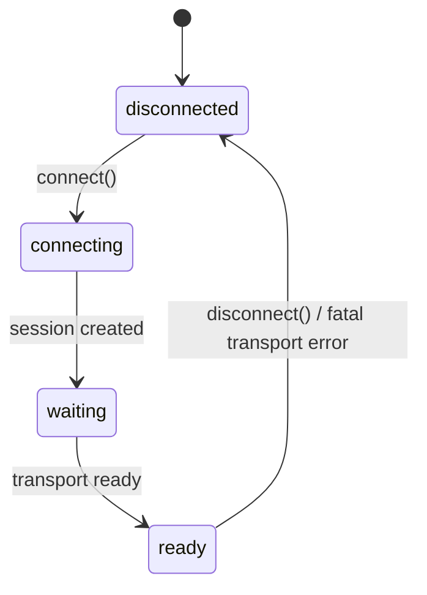

# Concepts

The mental model behind every Reactor client SDK, independent of language.
Read this once before [messaging.md](messaging.md) and
[recording.md](recording.md), which build on it.

## Sessions and connection state

Connecting establishes (or resumes) a **session** with a model over WebRTC.
A session always moves through the same four states, reported through a
`status_changed` event:

- `connecting` — the session is being created (or adopted, if you passed a
  `session_id`).
- `waiting` — the session exists but the model/runtime isn't ready yet.
- `ready` — you can send commands and media flows. This is the state to
  wait for before doing anything else.

`disconnect()` preserves the session so you can `reconnect()` later; there's
no separate "closed forever" state exposed to the SDK — a session that's
truly done just never becomes `ready` again.

## Tracks

A **track** is a named audio or video stream, always one-directional from
your point of view:

- **`recvonly`** — model output. You subscribe; you don't create these.
- **`sendonly`** — client input (camera, mic, generated frames). You must
  `publish_track(name)` before pushing frames, and `unpublish_track(name)`
  when done.

Track names and directions are **model-defined, not fixed by the SDK** —
you learn them from a `capabilities_received` event once the session is
ready, and use those exact names everywhere else (`publish_track`,
`push_video_frame`, `pause_track`, ...). `capabilities_received` also lists
which commands (see below) the model accepts.

`pause_track` / `resume_track` stop and restart delivery on a `recvonly`
track without tearing down the subscription — cheaper than
unpublish/republish for something you'll resume shortly.

## Commands and messages

Everything that isn't raw media goes over two logical channels, exposed
through `send_command` and a few events — see
[messaging.md](messaging.md) for the full reference:

- **`application`** scope (the default) — commands specific to the model
  you're talking to, and the messages it emits back.
- **`runtime`** scope — platform-level traffic: capabilities, recording
  requests (see [recording.md](recording.md)), moderation, ping.

## One shared core, growing platform support

The concepts on this page hold across every SDK, but they're not all built
the same way. Python and the other native platforms on the same C
interface (iOS, Android, ...) share one Rust implementation of
session/signaling logic, so protocol quirks and edge cases you learn on
one hold on every other one. The JavaScript SDK, `@reactor-team/js-sdk`, is
its own implementation — a browser drives WebRTC through its own APIs, not
through this repo's native code — that only shares the wire protocol (see
[the root README](../README.md#getting-started)) — it should
behave the same, but it isn't *guaranteed* identical the way the
C-ABI-based SDKs are to each other.

## Where handlers run

Not every event runs in the same place, because different events have
different backpressure needs:

- **Control events** — `status_changed`, `error`, `message`,
  `runtime_message`, `track_received`, `capabilities_received`,
  `session_id_changed` — are dispatched onto your application's event loop
  (in Python, `asyncio`), so you can touch loop-only state (an
  `asyncio.Event`, a `Queue`) directly inside the handler.
- **`frame` and `audio`** run on their own dedicated delivery threads
  instead, off your event loop. This is what lets them apply backpressure:
  if your handler is slower than the incoming rate, `frame` keeps only the
  newest one and drops the stale ones in between, while `audio` keeps its
  short backlog and drops new arrivals once it's full. Blocking in either
  is safe — it never stalls the connection — but you pay for it in dropped
  data, not in a growing queue. Reach your event loop from these two with
  an explicit hand-off (in Python, `loop.call_soon_threadsafe(...)`), not
  by awaiting or calling loop methods directly.

The result of an `await`-able call itself (`connect()`, `request_clip()`,
...) is always delivered back on your event loop, regardless of the above.
